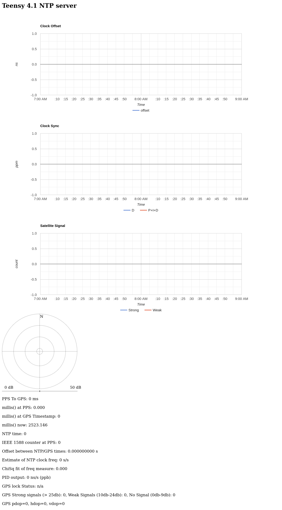

Connect teensy to host computer via usb
monitor the usb serial connection.
ex:

pio device monitor -e teensy_ntp

plug in the ethernet from router /switch to teensy.

This will be shown in the console:

    $ pio device monitor -e teensy_ntp
    --- Terminal on /dev/ttyACM0 | 115200 8-N-1
    --- Available filters and text transformations: colorize, debug, default, direct, hexlify, log2file, nocontrol, printable, send_on_enter, time
    --- More details at https://bit.ly/pio-monitor-filters
    --- Quit: Ctrl+C | Menu: Ctrl+T | Help: Ctrl+T followed by Ctrl+H
    enet link status: up
    netif status changed: ip 0.0.0.0, mask 0.0.0.0, gw 0.0.0.0
    netif status changed: ip 192.168.1.100, mask 255.255.255.0, gw 192.168.1.1

(this of course assumes the host computer is connected on the same router / swithc, here via wifi).



**For the adafruit ultimate GPS:** need to enable 

    #define GPS_USES_RMC

in settings.h


original notes from ddrown

Hardware:
* teensy 4.1 + ethernet connector
* GPS module with PPS on pin 35, GPS TX (pin 0), GPS RX (pin 1) (I'm using a ublox Neo-7N, but many others would work)

Software:
* put https://github.com/ddrown/teensy41_ethernet in your Arduino libraries folder

For the GPS module, you just need PPS, serial output at 115200, and ZDA NMEA messages enabled.  If you need a different GPS serial speed or need to use the RMC NMEA message, see the `settings.h` file.

For tests, see the `test/` directory.  It uses the ArduinoFake mock environment, which uses the FakeIt mock system and Unity unit tests.

For NTP+GPS status, go to http://[ip]

It will start generating a graph of the local Clock Offset, the local Clock Sync parameters, the Satellite Signal strength, and a "radar" view of the GPS satellites overhead.


IPv4 only:
```
Memory Usage on Teensy 4.1:
  FLASH: code:82364, data:17116, headers:9060   free for files:8017924
   RAM1: variables:86368, code:79688, padding:18616   free for local variables:339616
   RAM2: variables:12384  free for malloc/new:511904
```

IPv4+IPv6:
```
Memory Usage on Teensy 4.1:
  FLASH: code:99836, data:17116, headers:8996   free for files:8000516
   RAM1: variables:90176, code:97160, padding:1144   free for local variables:335808
   RAM2: variables:12384  free for malloc/new:511904
```

Test 022024

$ pio device monitor -e teensy_ntp
--- Terminal on /dev/ttyACM0 | 115200 8-N-1
--- Available filters and text transformations: colorize, debug, default, direct, hexlify, log2file, nocontrol, printable, send_on_enter, time
--- More details at https://bit.ly/pio-monitor-filters
--- Quit: Ctrl+C | Menu: Ctrl+T | Help: Ctrl+T followed by Ctrl+H
enet link status: up
netif status changed: ip 0.0.0.0, mask 0.0.0.0, gw 0.0.0.0
netif status changed: ip 192.168.50.131, mask 255.255.255.0, gw 192.168.50.1

Second test after changing settings/h to:

    #define GPS_USES_RMC
    #define GPS_BAUD 9600 //115200
    #define GPS_SERIAL Serial1
    #define DHCP_HOSTNAME "teensy-1"

$ pio device monitor -e teensy_ntp
--- Terminal on /dev/ttyACM0 | 9600 8-N-1
--- Available filters and text transformations: colorize, debug, default, direct, hexlify, log2file, nocontrol, printable, send_on_enter, time
--- More details at https://bit.ly/pio-monitor-filters
--- Quit: Ctrl+C | Menu: Ctrl+T | Help: Ctrl+T followed by Ctrl+H
Ethernet 1588 NTP Server
------------------------

S 16915651 3916133438
enet link status: up
netif status changed: ip 0.0.0.0, mask 0.0.0.0, gw 0.0.0.0
41915424 0.000009080 0.000009080 0.000000000 9997 3916133439
66915197 -0.000001833 0.000009080 0.000000001 8904 3916133440
91914970 -0.000000917 0.000009080 0.000000005 8994 3916133441
116914742 -0.000000851 0.000009080 0.800011635 9000 3916133442
141914515 -0.000000769 0.000009088 0.433346629 9015 3916133443
166914287 -0.000000674 0.000009093 0.825423300 9030 3916133444
191914058 -0.000000554 0.000009100 3.500125408 9048 3916133445
netif status changed: ip 192.168.50.131, mask 255.255.255.0, gw 192.168.50.1
216913830 -0.000000494 0.000009103 5.528710842 9056 3916133446
241913601 -0.000000395 0.000009109 9.520828247 9071 3916133447
266913372 -0.000000301 0.000009116 15.045511246 9088 3916133448
291913143 -0.000000240 0.000009120 21.666393280 9098 3916133449
316912914 -0.000000184 0.000009124 28.943321228 9107 3916133450
341912684 -0.000000097 0.000009129 42.006916046 9121 3916133451
366912454 -0.000000027 0.000009135 60.360809326 9134 3916133452
391912223 0.000000083 0.000009140 91.438621521 9150 3916133453
441911763 0.000000173 0.000009151 105.955444336 9170 3916133455

Query time from the teensy-ntp server:

    $ ntpdate -q 192.168.50.131
    server 192.168.50.131, stratum 1, offset +0.004430, delay 0.02733
     5 Feb 22:56:50 ntpdate[116303]: adjust time server 192.168.50.131 offset +0.004430 sec

